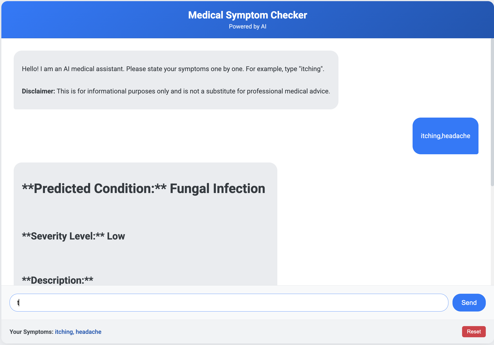

AI-Powered Medical Symptom Checker
This project is an intelligent, full-stack medical chatbot designed to assist users by predicting potential health conditions based on their symptoms. It leverages a dual-AI architecture, combining a traditional machine learning model for prediction with a powerful generative AI for clear, human-like explanations.

Screenshot:

✨ Key Features
Dual-AI Architecture:

Predictive Core: A Scikit-learn K-Nearest Neighbors (KNN) model performs the initial symptom-to-disease prediction.

Generative Layer: The Google Gemini API, implemented within a Retrieval-Augmented Generation (RAG) framework, provides fact-based and easy-to-understand explanations.

Multi-Symptom Input: Users can enter multiple symptoms at once (e.g., "itching, headache") for a more comprehensive analysis.

Symptom Severity Analysis: The application calculates a severity score based on the user's symptoms and adjusts its response accordingly, advising a doctor's visit for high-severity cases.

Interactive Symptom Suggestions: The chatbot proactively suggests related symptoms to the user, helping to guide the conversation and refine the prediction.

Conversational Memory: The application remembers all symptoms entered during a session, allowing the prediction to evolve and become more accurate as more information is provided.

Robust MLOps Pipeline: The entire model training process is automated in a clean pipeline, handling data ingestion, feature engineering (one-hot encoding), and model serialization.

🛠️ Technology Stack
Backend: Python, Flask

Machine Learning: Scikit-learn (KNN, MultiLabelBinarizer), Pandas, NumPy, Joblib

Generative AI: Google Gemini API (using a RAG architecture)

Frontend: HTML, CSS, JavaScript

Development: Git, venv (Virtual Environments), .env files

🚀 How to Run the Project Locally
Follow these steps to set up and run the chatbot on your own computer.

Step 1: Initial Setup
Clone the Repository:

git clone https://github.com/Satyam999999/AI-Powered-Medical-Symptom-Checker
cd AI-Powered-Medical-Chatbot

Create a Virtual Environment:

python3 -m venv venv
source venv/bin/activate

Install Dependencies:

pip install -r requirements.txt

Set Up API Key:

Create a new file in the main project folder named .env.

Open the .env file and add your Google Gemini API key:

GEMINI_API_KEY="YOUR_API_KEY_HERE"

Step 2: Train the Model
Before running the application for the first time, you must train the model. This script will create the artifacts folder with your model.pkl and preprocessor.pkl files.

python src/pipeline/train_pipeline.py

Step 3: Run the Application
Once the model is trained, start the Flask web server.

python app.py

Open your web browser and navigate to http://127.0.0.1:5010. Your chatbot should now be live and ready to use!

